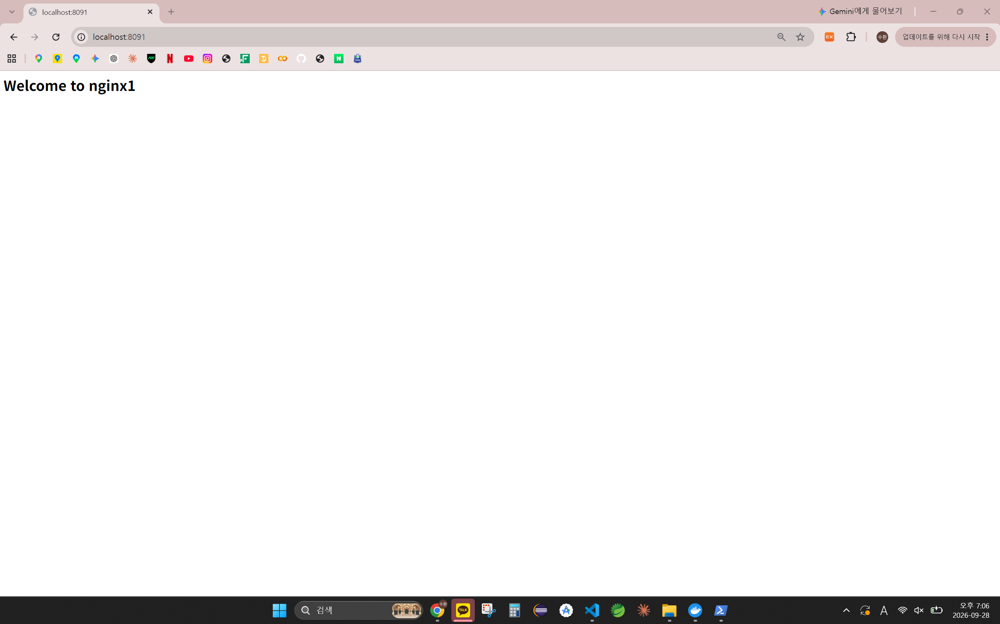
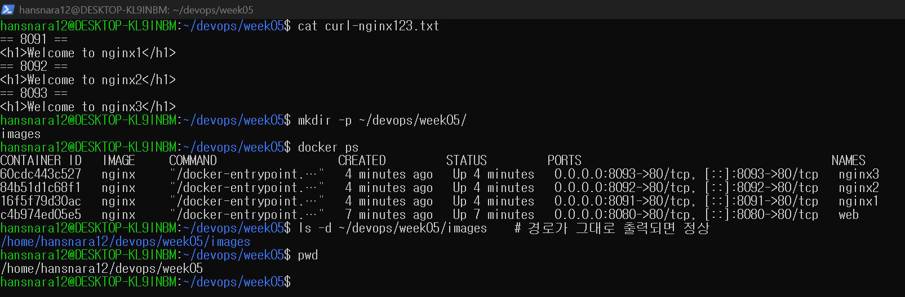

# 5주차 - Docker 기초와 GitHub Issue 기반 작업

Docker Desktop(WSL2 연동)을 설치하고 nginx 컨테이너로 포트 연결, 내부 수정, 삭제 후 재생성을 확인했다.
같은 `test.py`를 python 3.9 / 3.12 컨테이너로 실행해 버전 차이를 비교했고, 전 과정을 Issue #5 → 브랜치 → PR로 기록했다.

## 오늘 배운 내용

- VM(Guest OS마다 필요) vs 컨테이너(호스트 커널 공유, namespace·cgroup으로 격리)
- 이미지(읽기 전용 틀) → `docker run` → 컨테이너(실행 인스턴스), 이미지 1개로 컨테이너 N개
- `-d` 백그라운드 / `-p 호스트:컨테이너` 포트 연결 / `--name` 이름 / `-e` 환경 변수 / `--rm` 자동 삭제
- `exec`로 컨테이너 안을 수정해도, 컨테이너를 지우면 쓰기 계층과 함께 사라짐
- `-v "$PWD:/app" -w /app`으로 호스트 파일을 컨테이너에서 실행
- Issue → Branch → Commit/Push → PR(`Close #번호`) → Merge → Issue 자동 종료

상세는 맨 아래 개념 정리에.

## 새로 배운 명령어

```bash
# --- 실행 ---
docker run hello-world                               # 로컬에 이미지가 없으면 pull 후 실행
docker run -d -p 8080:80 --name web nginx            # 백그라운드 + 포트 연결 + 이름 지정
docker run -d -e MY_NAME=Kam --name env_test nginx   # 환경 변수 주입
docker run -it --rm ubuntu:24.04 bash                # 대화형 실행, 종료 시 자동 삭제
docker run --rm -v "$PWD:/app" -w /app python:3.12-slim python test.py  # 현재 폴더를 연결해 실행
# --- 상태 확인 ---
docker ps                                            # 실행 중인 컨테이너
docker ps -a                                         # 멈춘 컨테이너까지 전체
docker images                                        # 내려받은 이미지 목록
docker logs -f web                                   # 실시간 로그 (Ctrl+C로 종료)
docker system df                                     # 이미지·컨테이너 디스크 사용량
# --- 제어 ---
docker stop web                                      # 정지 (start / restart 로 다시 실행)
docker rm -f web                                     # 실행 중이어도 강제 삭제 (이미지는 남음)
docker exec -it web bash                             # 실행 중인 컨테이너 안에서 셸 실행
```

## 실행 방법

```bash
# Docker Desktop이 실행 중이어야 함
cd ~/devops/week05
docker run -d -p 8080:80 --name web nginx                                 # http://localhost:8080 접속
docker run --rm -v "$PWD:/app" -w /app python:3.9-slim python test.py     # SyntaxError
docker run --rm -v "$PWD:/app" -w /app python:3.12-slim python test.py    # two
docker rm -f web                                                          # 종료 및 정리
```

## 파일 구성

```
week05/
├── README.md
├── test.py                      # match-case 예제 (교수님 제공)
├── docker-version.txt           # docker --version 결과
├── docker-info.txt              # docker info 결과
├── docker-run-hello-world.txt   # hello-world 실행 결과
├── curl-result.txt              # curl -I http://localhost:8080 결과
├── docker-ps.txt                # web 컨테이너 실행 상태
├── curl-nginx123.txt            # 혼자서 해보기 nginx1~3 curl 결과
└── images/                      # nginx1~3 브라우저 화면, docker ps 캡처
```

## 실행 결과

- `Docker version 29.8.0, build 88096ef` / `hello-world` → `Hello from Docker!`
- `curl -I http://localhost:8080` → `HTTP/1.1 200 OK`, `Server: nginx/1.31.6`
- 컨테이너 안 `/etc/os-release`는 `Debian GNU/Linux 13` — 호스트(Ubuntu)와 사용자 공간은 다르고 커널만 공유
- index.html을 수정 → `<h1>Hi</h1>` → `docker rm -f` 후 재생성 → `<h1>Welcome to nginx!</h1>`로 복원
- `test.py`: python 3.9 → `SyntaxError: invalid syntax` / python 3.12 → `two`
- 혼자서 해보기: 8091 / 8092 / 8093 포트에 nginx1, nginx2, nginx3 실행, 각각 `<h1>Welcome to nginxN</h1>` 응답 확인

| nginx1 (8091) | nginx2 (8092) | nginx3 (8093) |
|---|---|---|
|  |  |  |



## 막혔던 부분

- `docker --version`은 되는데 `docker run`에서 `permission denied ... docker.sock` → PowerShell에서 `wsl --shutdown` 후 `wsl` 재접속으로 해결 (WSL 안에서 치면 `wsl: command not found`)
- 포트 충돌 에러가 나도 컨테이너 ID가 먼저 출력됨 → 컨테이너는 생성된 상태라 `docker rm -f web4`로 정리해야 함
- `docker run -d` 직후 바로 `curl -s`를 치면 빈 결과 → nginx가 뜨기 전이라 그런 것으로 추정, 잠시 후 다시 치면 정상
- `docker rm-f`, `cd~`처럼 공백을 빼먹어 `unknown command` → 명령과 옵션 사이 공백 확인
- `gh repo view --web`에서 `xdg-open` 에러 → WSL에 브라우저가 없어서, Windows 브라우저로 직접 열어 해결
- Windows 드라이브(`/mnt/d`)에서 복사한 png, `test.py`가 `100755`(실행 권한)로 커밋됨 → `chmod 644`로 권한을 내리고 다시 커밋
- PR 본문과 README에 `nginx1~3 (8091~8093)`처럼 한 줄에 `~`를 두 번 쓰면 GitHub에서 그 사이가 취소선으로 표시됨 → 수정 PR로 표현을 바꿈

---

<details>
<summary><b>개념 정리</b> (클릭해서 펼치기)</summary>

### Docker란 (8~11p)

- 애플리케이션을 개발(Develop), 배포(Ship), 실행(Run)하기 위한 오픈 플랫폼
- 앱과 실행 환경(라이브러리, 설정, 파일)을 컨테이너로 묶어 "내 컴퓨터에서는 되는데요?" 문제를 줄임
- 구성 요소: Image(읽기 전용 템플릿) / Container(이미지로 만든 인스턴스) / Dockerfile(이미지 제작 파일, 다음 시간) / Registry(이미지 저장소, 예: Docker Hub)
- Client-Server 구조: `docker` 명령(Client)이 Docker Daemon(`dockerd`)에 요청하고, dockerd가 이미지·컨테이너·네트워크·볼륨을 관리

### VM vs 컨테이너 (23~25p)

| 하이퍼바이저(VM) | 컨테이너 |
|---|---|
| VM마다 Guest OS 필요, 무거움 | 호스트 커널 공유, 가벼움 |
| 상대적으로 느린 시작 | 일반적으로 빠른 시작 |
| 이미지 GB 단위 | 이미지 MB 단위 |
| 강한 격리 | 프로세스 수준 격리 |

- namespace: 시야 격리("안 보이게"). 컨테이너 안 메인 프로세스는 PID 1, 자기 네트워크와 파일 시스템만 보임. 통신은 가능하지만 훔쳐보기는 불가
- cgroup: 자원 제한("많이 못 쓰게"). 메모리 상한, CPU 사용량 제한
- 리눅스 컨테이너는 리눅스 커널이 필요 → 윈도우는 WSL2 백엔드, 맥 Docker Desktop은 Linux VM 사용

### 이미지 vs 컨테이너, 레지스트리 (26~28p)

- 이미지 = 붕어빵 틀(읽기 전용, 1개) / 컨테이너 = 붕어빵(실행·정지 가능, 쓰기 가능, N개)
- 클래스 → 객체, 프로그램 → 프로세스 관계와 같음
- 컨테이너는 정지해도 파일이 유지되지만, 삭제하면 쓰기 계층이 사라짐
- 레지스트리 = 이미지 창고. `docker pull`로 받고 `docker push`로 올림 (Docker Hub, ghcr.io)

### nginx 컨테이너 실습 (30~35p)

- 호스트에 nginx도 python도 설치하지 않았지만, 이미지를 받아 컨테이너로 실행해 웹 서버가 뜸
- 컨테이너 안 포트는 모두 80이어도 충돌 없음(각자 네트워크 공간). 호스트 포트만 서로 달라야 함
- 같은 호스트 포트 → `port is already allocated`, 같은 이름 → `name ... is already in use`

### 컨테이너 안으로 (43~47p)

- `docker exec -it web bash`: `-i` 표준 입력 열기, `-t` 가상 터미널 할당
- `exit`로 나가도 컨테이너는 살아 있음 — exec로 띄운 bash는 추가 프로세스일 뿐
- 컨테이너 안에서 수정한 내용은 컨테이너를 삭제하면 사라짐. 수정된 나만의 이미지는 다음 시간(Dockerfile)

### 유용한 옵션 (49~54p)

- `-e`: 환경 변수 주입, `--rm`: 종료 시 자동 삭제, `-it`: 대화형 실행
- `-v "$PWD:/app"`: 현재 디렉터리를 컨테이너 `/app`에 연결, `-w /app`: 작업 디렉터리 지정
- `match-case`는 python 3.10부터 지원 → 3.9는 SyntaxError, 3.12는 정상 실행
- 호스트에 여러 버전을 설치하지 않고 이미지만 바꿔 테스트 가능

### GitHub Issue 기반 작업 흐름 (56~66p)

- Issue: 무엇을, 왜 할지 기록하고 완료 조건(체크박스)으로 진행 관리. 오류만 적는 곳이 아님
- Branch → Pull Request → Merge 순서로 반영
- PR 본문에 `Close #번호`(close / fix / resolve 계열)가 있으면 merge 시 Issue 자동 종료
- main에 커밋하지 않은 변경이 있을 때: 새 브랜치로 가져갈 거면 `git switch -c`, 아니면 `git stash`(새 파일까지는 `-u`) → `git stash pop`

</details>
